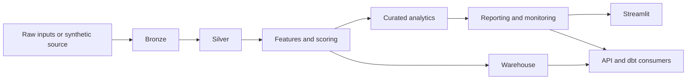

# Revenue Intelligence Platform

Production-minded revenue analytics repository that turns customer and order behavior into governed batch outputs, warehouse-ready tables, executive decision artifacts, and a Streamlit workspace for actioning revenue opportunities.

[](https://github.com/samuelmaia-analytics/Revenue-Intelligence-Platform-End-to-End-Analytics-ML-System/actions/workflows/ci.yml)
[](LICENSE)

Language versions:

- [Português do Brasil](README.pt-BR.md)
- [Português de Portugal](README.pt-PT.md)

Live demo: https://revenue-intelligence-platform.streamlit.app/
LinkedIn: https://linkedin.com/in/samuelmaia-analytics

## Executive Summary

This repository is designed to answer the questions a hiring manager, tech lead, or senior reviewer usually asks about data portfolio work:

- Is there one official runtime path?
- Can the pipeline be reprocessed safely?
- Are outputs validated and governed?
- Is there operational evidence when runs fail?
- Does the dashboard consume trusted artifacts rather than re-implementing business logic?

Short answer: yes.

It is also designed around a practical business question:

**Where should the business act first to protect revenue and improve growth efficiency?**

## Reviewer Snapshot

In less than 30 seconds, a reviewer should be able to see that this repository has:

- one official batch runtime path
- governed outputs with contracts and validation
- operational evidence through manifests, snapshots, and quality reports
- downstream consumption through Streamlit, API, SQL, and dbt
- CI coverage that goes beyond unit tests into smoke and build validation

## Why This Repository Exists

Most data portfolio projects stop at notebooks, ad hoc scripts, or a standalone dashboard.
This repository is intentionally narrower and more operational:

- one official batch entrypoint
- deterministic and reprocessable outputs
- runtime manifests, logs, snapshots, and retention rules
- governed processed artifacts with validation and contracts
- downstream consumers that read the batch core instead of replacing it

The goal is not to simulate an enterprise platform without substance.
The goal is to demonstrate sound engineering judgment in a repository small enough to inspect end-to-end.

## Business Value

The platform converts customer behavior data into assets that support commercial and retention decisions:

- churn risk and next-purchase propensity
- unit economics by acquisition channel
- cohort retention analysis
- customer-level recommendations with simulated impact
- executive KPI snapshots and monitoring outputs
- warehouse tables ready for SQL and dbt-style consumption

Latest published run:

- Simulated net impact (Top 10 actions): **2,550.13**
- Simulated ROI (Top 10 actions): **1.58x**
- Revenue uplift over baseline (90d, Top 10 actions): **+4,165.63**

For a hiring reviewer, the practical signal is simple: this is not a notebook showcase dressed up as a platform.
It is a small but disciplined data system with explicit runtime ownership and downstream accountability.

## Official Runtime Path

```powershell
python -m src.pipeline run
```

The batch pipeline is the system of record.
The Streamlit app, API layer, warehouse, and dbt project all consume outputs produced by it.

## Architecture



Key characteristics:

- batch-first architecture with local reproducibility
- explicit runtime policy for retries, retention, freshness, and quality thresholds
- processed and operational report validation before pipeline completion
- SQLite warehouse by default, with compatibility paths for service and dbt consumers

## Scope and Capabilities

- Data ingestion from Kaggle source with synthetic fallback
- Layered pipeline: raw, bronze, silver, gold
- Feature engineering and customer-level scoring
- Star schema outputs for analytics interoperability
- KPI layer: LTV, CAC, RFM, cohort retention, and unit economics
- ML layer: churn and next purchase prediction
- Recommendation engine for next-best action
- Executive Streamlit dashboard with governance and exports
- Structured SQL domains under `ddl/` and `analytics/`

## Repository Structure

```text
.
|- .github/                CI workflows, issue templates, and repository governance
|- app/                    Streamlit presentation layer
|  |- ui/                  reusable UI primitives and styles
|  |- views/               page sections and dashboard composition
|  |- dashboard_data.py    cached artifact loading and filtering
|  |- dashboard_i18n.py    EN, PT-BR, and PT-PT language dictionaries
|  |- dashboard_metrics.py shared formatting and KPI helpers
|- src/                    batch pipeline, modeling, reporting, warehouse, and runtime policy
|- contracts/              versioned governed schemas and compatibility shims
|- services/               runtime-facing service interfaces
|- api/                    compatibility shim for API imports
|- tests/                  behavioral, reliability, contract, API, and warehouse coverage
|- docs/                   architecture, onboarding, runbooks, ADRs, and release notes
|- scripts/                smoke tests and lightweight operational automation
|- dbt/                    downstream analytical layer on top of warehouse outputs
|- orchestration/          scheduler examples and deployment wrappers
|- metrics/                semantic metric definitions consumed by the pipeline
|- sql/                    warehouse DDL and downstream SQL assets
|- data/                   local runtime outputs, manifests, snapshots, and warehouse
|- notebooks/              isolated exploration, kept out of the official runtime path
|- main.py                 minimal Python entrypoint wrapper
|- Dockerfile*             container builds for Streamlit and API surfaces
|- CHANGELOG.md            release-oriented evolution log
`- README.md               main entry point
```

Primary references:

- [docs/README.md](docs/README.md)
- [docs/architecture.md](docs/architecture.md)
- [docs/governance_framework.md](docs/governance_framework.md)
- [docs/runtime_surfaces.md](docs/runtime_surfaces.md)
- [docs/environments.md](docs/environments.md)
- [docs/ci_cd.md](docs/ci_cd.md)
- [docs/repository_structure.md](docs/repository_structure.md)
- [docs/runbook.md](docs/runbook.md)
- [docs/troubleshooting_matrix.md](docs/troubleshooting_matrix.md)
- [docs/release_process.md](docs/release_process.md)
- [docs/deprecation_policy.md](docs/deprecation_policy.md)
- [docs/merge_policy.md](docs/merge_policy.md)
- [docs/sql_examples.md](docs/sql_examples.md)
- [docs/incident_playbooks.md](docs/incident_playbooks.md)
- [docs/hiring_review.md](docs/hiring_review.md)

## Data Model and Outputs

Primary file:

- `data/raw/E-commerce Customer Behavior - Sheet1.csv`

Normalized into:

- `customers.csv`
- `orders.csv`
- `marketing_spend.csv`
- `data/bronze/*.csv`
- `data/silver/*.csv`
- `data/gold/dim_*.csv`
- `data/gold/fact_*.csv`

Main outputs:

- `data/processed/scored_customers.csv`
- `data/processed/recommendations.csv`
- `data/processed/cohort_retention.csv`
- `data/processed/unit_economics.csv`
- `data/processed/executive_report.json`
- `data/processed/executive_summary.json`
- `data/processed/business_outcomes.json`
- `data/processed/top_10_actions.csv`
- `data/processed/metrics_report.json`

## API Delivery

The serving layer is FastAPI-based, with versioned endpoints and basic runtime controls.

Canonical runtime endpoint:

- `services/api/main.py`

Available endpoints:

- `GET /api/v1/health`
- `POST /api/v1/score`

Security and quota:

- API key support in demo mode
- Rate limiting per token or IP
- Runtime configuration through environment variables

The API is positioned as a lightweight delivery layer for analytical outputs, not as an isolated backend exercise.

## Streamlit Workspace

The dashboard is not a second source of truth.
It consumes processed artifacts generated by the batch pipeline and is organized into:

- `app/ui` for layout primitives and visual consistency
- `app/views` for business sections and user flows
- `app/dashboard_data.py` for cached artifact access
- `app/dashboard_i18n.py` for `EN`, `PT-BR`, and `PT-PT`

## Reliability and Data Engineering Signals

- idempotent batch execution and reprocessing support
- configurable retry policy per stage
- explicit backfill window in CLI and manifests
- freshness, quality, and processed artifact validation reports
- operational reports validated as part of the processed contract surface
- runtime manifests, logs, and snapshots for traceability
- warehouse persistence plus downstream consumption validation
- partner-facing payload generated from governed processed exports
- smoke-tested Streamlit dashboard in CI

## Local Setup

```powershell
python -m venv .venv
.venv\Scripts\activate
python -m pip install --upgrade pip
python -m pip install -e .[dev]
Copy-Item .env.example .env
```

Optional dbt CLI setup in an isolated environment:

```powershell
python -m venv .dbt-venv
.dbt-venv\Scripts\activate
python -m pip install --upgrade pip
python -m pip install dbt-core dbt-sqlite
```

Important environment variables:

- `RIP_DATA_DIR`
- `RIP_WAREHOUSE_TARGET`
- `RIP_RETRY_ATTEMPTS`
- `RIP_QUALITY_MAX_NULL_FRACTION`
- `RIP_BACKFILL_START_DATE`
- `RIP_BACKFILL_END_DATE`

## Run Commands

Pipeline:

```powershell
python -m src.pipeline run
```

Backfill:

```powershell
python -m src.pipeline run --start-date 2025-01-01 --end-date 2025-03-31
```

Streamlit:

```powershell
streamlit run app/streamlit_app.py
```

Make-based workflow:

```powershell
make verify
make smoke-dashboard
make pipeline
```

## Validation and Automation

Core validation commands:

```powershell
python -m ruff check .
python -m black --check .
python -m isort --check-only .
python -m mypy src services contracts main.py
python -m pytest -q --cov=src --cov=services --cov=contracts --cov-report=term-missing
python scripts/smoke_dashboard.py
python scripts/smoke_api.py
python scripts/smoke_downstream_sql.py
python scripts/smoke_processed_exports.py
python scripts/smoke_partner_payload.py
python scripts/smoke_dbt_sqlite.py
python -m build
```

Automation surfaces:

- `Makefile` for local developer workflows
- `.pre-commit-config.yaml` for fast local quality gates
- `.github/workflows/ci.yml` for lint, tests, smoke, and build validation
- dbt-on-SQLite downstream smoke against the generated warehouse
- downstream smoke scripts sharing a temporary-runtime helper in `scripts/smoke_support.py`

## Governance and Operating Standards

- runtime changes must preserve `python -m src.pipeline run` as the canonical path
- SQL examples should stay portable to the documented SQLite-first environment unless a dialect requirement is explicit
- README, runbook, release notes, and CI should change together when operational behavior changes
- versioned contract source of truth remains `contracts/v1/data_contract.py`

## SQL Consumption Examples

See [docs/sql_examples.md](docs/sql_examples.md) for practical warehouse queries covering channel economics, recommendation ranking, cohort retention, and executive segment views.

## Technical Decisions and Trade-offs

- SQLite is the default warehouse because local reproducibility matters more than introducing mandatory external infrastructure
- the project is batch-first on purpose
- the Streamlit app consumes artifacts instead of recomputing core business logic
- compatibility shims exist, but canonical imports remain explicit and documented

## Operational Reading Order

If you are reviewing the repository for technical depth, read in this order:

1. this `README`
2. [docs/architecture.md](docs/architecture.md)
3. [docs/runtime_surfaces.md](docs/runtime_surfaces.md)
4. [docs/runbook.md](docs/runbook.md)
5. [docs/troubleshooting_matrix.md](docs/troubleshooting_matrix.md)
6. [docs/adr/README.md](docs/adr/README.md)
7. [docs/repository_structure.md](docs/repository_structure.md)
8. [docs/hiring_review.md](docs/hiring_review.md)

## What This Repository Is Not

- not a notebook collection
- not a fake enterprise monorepo
- not a streaming platform demo
- not an MLOps platform clone

It is a production-minded batch analytics system sized honestly for a strong senior-level portfolio.

## Docker

```bash
docker build -t revenue-intelligence .
docker run -p 8501:8501 revenue-intelligence

docker build -f Dockerfile.api -t revenue-intelligence-api .
docker run -p 8000:8000 revenue-intelligence-api
```

## Roadmap

Current high-impact next steps:

1. expand processed artifact contracts and integration coverage
2. deepen downstream warehouse and dbt validation beyond SQLite local-first assumptions
3. accumulate more small, coherent release notes
4. add a lightweight visual regression strategy for the dashboard

## Contribution

See [CONTRIBUTING.md](CONTRIBUTING.md) for workflow expectations, commit conventions, validation standards, and repository boundaries.
