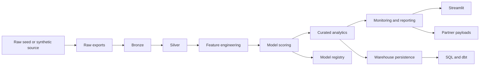

# Revenue Intelligence Platform

Production-minded batch analytics repository that turns customer and order behavior into governed artifacts, warehouse-ready tables, executive decision outputs, and downstream consumption surfaces.

Language versions:

- [Português do Brasil](README.pt-BR.md)
- [Português de Portugal](README.pt-PT.md)

## Reviewer Snapshot

In less than 30 seconds, a reviewer should be able to verify that this repository has:

- one official batch runtime path: `python -m src.pipeline run`
- explicit raw, bronze, silver, curated, and serving boundaries
- governed outputs with versioned contracts, manifests, quality checks, and artifact validation
- downstream consumers that read pipeline outputs instead of re-implementing business logic
- local reproducibility with SQLite by default, plus API, Streamlit, SQL, and dbt integration
- CI that covers lint, typing, tests, smoke checks, packaging, dbt, and container builds

## Why This Repository Exists

Most portfolio data projects stop at notebooks, a dashboard, or a set of disconnected scripts. This repository is intentionally narrower and more disciplined.

The goal is to show engineering judgment that is credible in a hiring review:

- one runtime path owns the batch system of record
- transformations are staged and traceable
- processed artifacts are validated before the run is considered successful
- runtime evidence exists through logs, manifests, snapshots, and retention rules
- downstream surfaces consume trusted outputs instead of becoming parallel sources of truth

This is not an attempt to imitate a large enterprise platform. It is a compact data system designed to be inspectable end-to-end.

## Business Value

The pipeline converts customer behavior into assets that support revenue and retention decisions:

- churn risk and next-purchase propensity
- channel-level unit economics
- cohort retention analysis
- customer-level recommendations with simulated impact
- executive KPI summaries and monitoring artifacts
- warehouse tables ready for SQL and dbt consumption

## System of Record

Official runtime:

```powershell
python -m src.pipeline run
```

The batch pipeline is the center of gravity for the repository. The Streamlit app, API layer, warehouse, dbt project, SQL assets, and partner payloads all consume artifacts generated by it.

## Architecture



Core design choices:

- batch-first by design
- SQLite default for local reproducibility
- runtime manifests, logs, snapshots, retention, and retry policy
- versioned contracts and validation for processed outputs
- explicit separation between orchestration, runtime operations, and data services

## Repository Structure

```text
.
|- .github/                repository automation, CI, issue templates, PR template
|- api/                    compatibility shim for legacy API imports
|- app/                    Streamlit presentation layer
|- contracts/              governed schema contracts and compatibility paths
|- data/                   local runtime artifacts and sample seed data
|- dbt/                    downstream analytics layer over warehouse outputs
|- docs/                   architecture, onboarding, runbooks, ADRs, releases
|- metrics/                semantic metric definitions
|- notebooks/              isolated exploration, not part of the official runtime
|- orchestration/          scheduler examples and deployment wrappers
|- scripts/                smoke checks and lightweight operational helpers
|- services/               runtime-facing service interfaces
|- sql/                    DDL and downstream SQL examples
|- src/                    batch core, pipeline runtime, services, modeling, reporting
|- tests/                  regression, runtime, API, warehouse, and governance coverage
|- CHANGELOG.md            release-oriented project history
|- CONTRIBUTING.md         contribution workflow and engineering expectations
|- Makefile                developer workflow entrypoints
|- pyproject.toml          package, dependency, lint, type-check, and coverage config
```

Important code boundaries inside `src/`:

- `src.pipeline`: CLI entrypoint
- `src.orchestration`: pipeline coordination
- `src.pipeline_runtime`: manifests, retention, snapshots, freshness, backfill helpers
- `src.pipeline_services`: silver validation, quality gates, serving artifacts, warehouse frames
- `src.ingestion`, `src.transformation`, `src.modeling`, `src.reporting`: domain behavior by stage

## Data Flow

1. A seed dataset is resolved from the runtime directory, bundled sample CSV, or deterministic synthetic generation.
2. Raw exports are normalized into bronze.
3. Bronze is cleaned and validated into silver.
4. Silver drives feature engineering and model scoring.
5. Curated analytics, reporting, monitoring, and partner-ready artifacts are generated.
6. Trusted outputs are validated and persisted into the warehouse.
7. Snapshots, manifests, and logs capture runtime evidence.

Raw seed precedence:

1. `RIP_DATA_DIR/raw/E-commerce Customer Behavior - Sheet1.csv`
2. bundled sample CSV in `data/raw/` when the runtime directory points elsewhere
3. deterministic synthetic generation

## Reliability and Engineering Signals

- idempotent batch execution for curated outputs
- explicit retry policy and backoff settings
- backfill window support in CLI and manifests
- freshness, quality, and artifact validation reports
- runtime success and failure manifests
- snapshot retention and failure manifest cleanup
- queryable warehouse persistence with downstream validation
- smoke coverage for dashboard, API, SQL, processed exports, partner payloads, dbt, and containers

## Local Setup

```powershell
python -m venv .venv
.\.venv\Scripts\activate
python -m pip install --upgrade pip
python -m pip install -e .[dev]
Copy-Item .env.example .env
pre-commit install
```

Optional dbt CLI environment:

```powershell
python -m venv .dbt-venv
.\.dbt-venv\Scripts\activate
python -m pip install --upgrade pip
python -m pip install dbt-core dbt-sqlite
```

## Configuration

Main environment variables:

- `RIP_ENV`
- `RIP_DATA_DIR`
- `RIP_WAREHOUSE_TARGET`
- `RIP_WAREHOUSE_URL`
- `RIP_WAREHOUSE_SCHEMA`
- `RIP_RETRY_ATTEMPTS`
- `RIP_RETRY_BACKOFF_SECONDS`
- `RIP_QUALITY_MAX_NULL_FRACTION`
- `RIP_FRESHNESS_MAX_AGE_HOURS`
- `RIP_BACKFILL_START_DATE`
- `RIP_BACKFILL_END_DATE`
- `RIP_SYNTHETIC_CUSTOMERS`
- `RIP_ALLOW_BUNDLED_SEED_FALLBACK`
- `RIP_ALERT_WEBHOOK_URL`

See [.env.example](.env.example) and [docs/environments.md](docs/environments.md) for details.

## Runbook Commands

Pipeline:

```powershell
python -m src.pipeline run
```

Backfill:

```powershell
python -m src.pipeline run --start-date 2025-01-01 --end-date 2025-03-31
```

Governance artifacts only:

```powershell
python -m src.pipeline artifacts
```

Streamlit:

```powershell
streamlit run app/streamlit_app.py
```

API:

```powershell
uvicorn services.api.main:app --host 0.0.0.0 --port 8000 --reload
```

## Developer Automation

High-signal local commands:

```powershell
make bootstrap
make verify-core
make verify
make pipeline
make smoke-dashboard
make smoke-api
make smoke-dbt
make smoke-postgres-optional
```

What they do:

- `make bootstrap`: install runtime and development dependencies in editable mode
- `make verify-core`: lint, type-check, tests, and build
- `make verify`: `verify-core` plus smoke checks and dbt validation
- `make pipeline`: run the official batch path

Pre-commit covers fast local gates for whitespace, YAML/TOML hygiene, imports, formatting, and typing.

## Validation Standard

Core quality gates:

```powershell
python -m ruff check .
python -m black --check .
python -m isort --check-only .
python -m mypy src services contracts main.py
python -m pytest -q --cov=src --cov=services --cov=contracts --cov-report=term-missing
python -m build
```

Downstream and smoke validation:

```powershell
python scripts/smoke_dashboard.py
python scripts/ui_snapshot.py
python scripts/smoke_api.py
python scripts/smoke_downstream_sql.py
python scripts/smoke_processed_exports.py
python scripts/smoke_partner_payload.py
python scripts/smoke_dbt_sqlite.py
```

## Documentation Map

Recommended reading order for technical review:

1. [README.md](README.md)
2. [docs/architecture.md](docs/architecture.md)
3. [docs/runtime_surfaces.md](docs/runtime_surfaces.md)
4. [docs/runbook.md](docs/runbook.md)
5. [docs/troubleshooting_matrix.md](docs/troubleshooting_matrix.md)
6. [docs/repository_structure.md](docs/repository_structure.md)
7. [docs/adr/README.md](docs/adr/README.md)
8. [docs/hiring_review.md](docs/hiring_review.md)

Useful operational references:

- [docs/environments.md](docs/environments.md)
- [docs/incident_playbooks.md](docs/incident_playbooks.md)
- [docs/local_benchmark.md](docs/local_benchmark.md)
- [docs/processed_contracts.md](docs/processed_contracts.md)
- [docs/release_process.md](docs/release_process.md)
- [docs/sql_examples.md](docs/sql_examples.md)
- [docs/deprecation_policy.md](docs/deprecation_policy.md)
- [docs/merge_policy.md](docs/merge_policy.md)

## Technical Decisions and Trade-offs

- SQLite is the default warehouse because local reproducibility matters more than forcing external infrastructure.
- Postgres is an optional compatibility target, including schema-prefixed smoke validation when credentials are available.
- The project is intentionally batch-first. It demonstrates reliable analytics engineering, not a fake streaming demo.
- The Streamlit app and API consume pipeline outputs and model registry artifacts instead of becoming alternate orchestration layers.
- The repository prefers explicit contracts and visible runtime evidence over hidden convenience.

Processed contract versioning, rollback expectations, and the repository decision about `data/processed` are documented in [docs/processed_contracts.md](docs/processed_contracts.md).
Only `data/processed/metrics_report.json` remains versioned as a lightweight reviewer-facing reference artifact.

## What This Repository Is Not

- not a notebook collection
- not a synthetic enterprise monorepo
- not a streaming platform showcase
- not an MLOps control plane clone

It is a compact, production-minded analytics repository intended to look credible under detailed technical review.

## Contribution and Commit Convention

Contribution workflow, review standards, and commit convention live in [CONTRIBUTING.md](CONTRIBUTING.md).

Commit style:

- `feat:` capability change
- `fix:` defect correction
- `refactor:` internal improvement without intended behavior change
- `test:` test-only change
- `docs:` documentation-only change
- `chore:` tooling or maintenance

## Roadmap

Near-term improvements with the best technical payoff:

1. deepen processed contracts and contract regression tests
2. expand downstream warehouse and dbt assertions beyond local SQLite assumptions
3. keep accumulating small, coherent release notes
4. add a lightweight visual regression strategy for the Streamlit layer

## License

This work is licensed under a Creative Commons Attribution-NonCommercial 4.0 International License (CC BY-NC 4.0).

To view a copy of this license, visit:
https://creativecommons.org/licenses/by-nc/4.0/

[](https://creativecommons.org/licenses/by-nc/4.0/)

