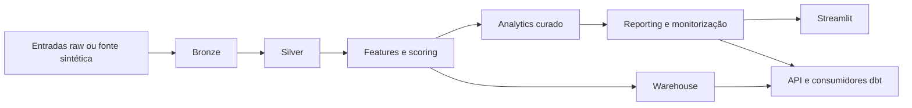

# Revenue Intelligence Platform

Repositório de analytics de receita orientado para produção que transforma comportamento de clientes e encomendas em saídas batch governadas, tabelas para warehouse, artefactos executivos de decisão e um workspace Streamlit para acção comercial.

Versões disponíveis:

- [Internacional](README.md)
- [Português do Brasil](README.pt-BR.md)

## Resumo Executivo

Este repositório foi desenhado para responder às perguntas que um hiring manager, tech lead ou avaliador sénior costuma fazer sobre projectos de dados:

- existe um caminho oficial de execução?
- o pipeline é reprocessável com segurança?
- os outputs são governados e validados?
- há evidência operacional quando algo falha?
- o dashboard consome artefactos confiáveis em vez de reimplementar a lógica crítica?

Resposta curta: sim.

## Leitura Rápida Para Reviewer

Em menos de 30 segundos, alguém a avaliar o repositório deve conseguir ver que ele tem:

- um caminho oficial de execução batch
- outputs governados com contratos e validação
- evidência operacional via manifests, timeline de eventos, snapshots e relatórios de qualidade
- consumo downstream por Streamlit, API, SQL e dbt
- CI que vai além de testes unitários e cobre smoke e build

## Porque Este Repositório Existe

Muitos projectos de portefólio ficam presos a notebooks, scripts ad hoc ou um dashboard isolado. Este repositório é intencionalmente mais operacional:

- um entrypoint batch oficial
- saídas determinísticas e reprocessáveis
- manifests, logs, snapshots e retenção de execução
- timeline governada de observabilidade via `run_events.jsonl`
- artefactos processados com validação e contratos
- consumidores downstream que leem o core batch em vez de o substituir

O objectivo não é simular uma plataforma enterprise sem substância. O objectivo é demonstrar critério de engenharia num repositório pequeno o suficiente para ser auditado de ponta a ponta.

## Valor de Negócio

A plataforma converte comportamento de clientes em activos que suportam decisões comerciais e de retenção:

- risco de churn e propensão de próxima compra
- unit economics por canal de aquisição
- retenção por coorte
- recomendações por cliente com impacto simulado
- snapshots executivos de KPI e monitorização
- tabelas de warehouse prontas para SQL e consumo ao estilo dbt

## Camada Executiva Olist

Com os CSVs actuais do Olist em `data/raw/`, o repositório entrega agora uma camada analítica mais profunda, sem depender de uma modelação simplificada de demonstração.

O que passa a existir de forma governada:

- entidades `silver` enriquecidas para clientes, encomendas, itens, pagamentos, reviews, produtos, sellers e geografia
- tabelas `gold` para consumo em warehouse, com factos de encomendas e itens e dimensões de cliente, produto, seller, data e geografia
- métricas executivas para receita, ticket médio, frete, recorrência, entrega, atraso, satisfação, concentração de sellers, concentração de categorias e performance por estado
- analytics de cliente com proxy de churn, propensão de recompra, proxy de LTV, RFM e acção recomendada
- scorecards curated prontos para BI em pagamentos, retenção, sellers, categorias, estados, operações e resumo executivo

Política importante:

- CAC e unit economics continuam explicitamente tratados como métricas proxy, porque o Olist não inclui custo real de aquisição
- o projecto privilegia transparência metodológica em vez de precisão artificial

Para um avaliador técnico, o sinal prático é directo: este não é um showcase de notebooks disfarçado de plataforma. É um sistema de dados pequeno, mas disciplinado, com ownership claro de runtime e responsabilidade sobre consumidores downstream.

## Caminho Oficial de Execução

```powershell
python -m src.pipeline run
```

O pipeline batch é a fonte oficial de verdade. O Streamlit, a API, o warehouse e o projecto dbt consomem os outputs produzidos por ele.

## Arquitectura



Características principais:

- arquitectura batch-first com reprodutibilidade local
- política explícita de runtime para retry, retenção, freshness e thresholds de qualidade
- validação de artefactos processados antes da conclusão do pipeline
- warehouse SQLite por omissão, com caminhos compatíveis para serviços e dbt

## Estrutura do Repositório

```text
.
|- .github/                workflows de CI, templates e governação do repositório
|- app/                    camada de apresentação em Streamlit
|  |- ui/                  primitives reutilizáveis e estilos
|  |- views/               secções da página e composição do dashboard
|  |- dashboard_data.py    carregamento com cache e filtros
|  |- dashboard_i18n.py    dicionários EN, PT-BR e PT-PT
|  |- dashboard_metrics.py helpers partilhados de formatação e KPIs
|- src/                    pipeline batch, modelação, reporting, warehouse e política operacional
|- contracts/              schemas governados versionados e shims de compatibilidade
|- services/               interfaces de serviço voltadas para runtime
|- api/                    shim de compatibilidade para imports da API
|- tests/                  cobertura comportamental, confiabilidade, contratos, API e warehouse
|- docs/                   arquitectura, onboarding, runbooks, ADRs e release notes
|- scripts/                smoke tests e automações operacionais leves
|- dbt/                    camada analítica downstream sobre os outputs do warehouse
|- orchestration/          exemplos de scheduler e wrappers de deploy
|- metrics/                definições de métricas semânticas consumidas pelo pipeline
|- sql/                    DDL do warehouse e assets SQL downstream
|- data/                   outputs locais de runtime, manifests, snapshots e warehouse
|- notebooks/              exploração isolada, fora do caminho oficial de execução
|- main.py                 wrapper mínimo de entrada Python
|- Dockerfile*             builds de contentor para Streamlit, batch e API
|- CHANGELOG.md            histórico de evolução orientado a releases
```

Referências principais:

- [docs/README.md](docs/README.md)
- [docs/architecture.md](docs/architecture.md)
- [docs/governance_framework.md](docs/governance_framework.md)
- [docs/runtime_surfaces.md](docs/runtime_surfaces.md)
- [docs/environments.md](docs/environments.md)
- [docs/ci_cd.md](docs/ci_cd.md)
- [docs/github_actions_workflows.md](docs/github_actions_workflows.md)
- [docs/repository_structure.md](docs/repository_structure.md)
- [docs/runbook.md](docs/runbook.md)
- [docs/troubleshooting_matrix.md](docs/troubleshooting_matrix.md)
- [docs/release_process.md](docs/release_process.md)
- [docs/deprecation_policy.md](docs/deprecation_policy.md)
- [docs/merge_policy.md](docs/merge_policy.md)
- [docs/sql_examples.md](docs/sql_examples.md)
- [docs/incident_playbooks.md](docs/incident_playbooks.md)
- [docs/lgpd_data_governance.md](docs/lgpd_data_governance.md)
- [docs/hiring_review.md](docs/hiring_review.md)

## Sinais de Maturidade em Engenharia de Dados

- execução idempotente e reprocessável
- retry configurável por estágio
- janela explícita de backfill na CLI e nos manifests
- relatórios de freshness, qualidade e validação de artefactos processados
- manifests, logs, timeline de eventos e snapshots para rastreabilidade
- persistência em warehouse com validação de consumo downstream
- payload parceiro gerado a partir de exports processados governados
- dashboard Streamlit com smoke test no CI
- separação explícita entre contentores de dashboard, runtime batch e API

## Workspace Streamlit

O dashboard não é uma segunda fonte de verdade. Consome os artefactos processados e está organizado em:

- `app/ui` para primitives de layout e consistência visual
- `app/views` para secções de negócio e fluxo de leitura
- `app/dashboard_data.py` para acesso com cache aos artefactos
- `app/dashboard_i18n.py` para `EN`, `PT-BR` e `PT-PT`

Superfícies actuais:

- `app/streamlit_app.py`: command center executivo principal, com narrativa premium orientada a negócio
- `app/pages/`: navegação multipage compatível, reutilizando os mesmos artefactos governados e as mesmas views partilhadas

Páginas de negócio cobertas:

- visão geral executiva
- receita em risco
- performance por segmento
- projecções e cenários
- confiabilidade operacional
- governação e confiança de dados

Princípio de produto:

- a lógica de métricas permanece no pipeline e nos artefactos processados
- a UI apenas consome, organiza e apresenta os outputs governados
- PT-BR é actualmente a via visual mais refinada do projecto

## Setup Local

```powershell
python -m venv .venv
.venv\Scripts\activate
python -m pip install --upgrade pip
python -m pip install -e .[dev]
Copy-Item .env.example .env
```

Setup opcional do CLI `dbt` num ambiente isolado:

```powershell
python -m venv .dbt-venv
.dbt-venv\Scripts\activate
python -m pip install --upgrade pip
python -m pip install dbt-core dbt-sqlite
```

Variáveis de ambiente mais importantes:

- `RIP_DATA_DIR`
- `RIP_WAREHOUSE_TARGET`
- `RIP_RETRY_ATTEMPTS`
- `RIP_QUALITY_MAX_NULL_FRACTION`
- `RIP_BACKFILL_START_DATE`
- `RIP_BACKFILL_END_DATE`

## Comandos Principais

Pipeline:

```powershell
python -m src.pipeline run
```

Backfill:

```powershell
python -m src.pipeline run --start-date 2025-01-01 --end-date 2025-03-31
```

Streamlit:

```powershell
.\scripts\dev\start.ps1 -Target app -SkipPipeline
```

Fluxo com Make:

```powershell
make verify
make smoke-dashboard
make pipeline
make observability
```

Resumo operacional exportável:

```powershell
python -m src.pipeline observability --output-path data/processed/observability_summary.json
```

## Validação e Automação

Comandos centrais:

```powershell
python -m ruff check .
python -m black --check .
python -m isort --check-only .
python -m mypy src services contracts main.py
python -m pytest -q --cov=src --cov=services --cov=contracts --cov-report=term-missing
python scripts/smoke_dashboard.py
python scripts/smoke_api.py
python scripts/smoke_downstream_sql.py
python scripts/smoke_processed_exports.py
python scripts/smoke_partner_payload.py
python scripts/smoke_dbt_sqlite.py
python -m build
```

Camadas de automação:

- `Makefile` para o fluxo local do developer
- `.pre-commit-config.yaml` para gates rápidos antes do commit
- `.github/workflows/ci.yml` para lint, testes, smoke e build
- `.github/workflows/ci.yml` separa validação de qualidade, governação, dbt sobre SQLite e containers para simplificar o diagnóstico
- `.github/workflows/ci.yml` também valida consumo dbt real sobre o warehouse SQLite gerado pelo pipeline
- `.github/workflows/ci.yml` publica `run_events.jsonl` e `observability_summary.json` como evidência operacional do batch
- os smokes downstream partilham um helper comum de runtime temporário em `scripts/smoke_support.py`

Checkpoints de governação:

- alterações de runtime devem preservar `python -m src.pipeline run` como caminho canónico
- exemplos SQL devem manter-se portáveis para o ambiente SQLite-first documentado, salvo quando o dialecto exigido estiver explícito
- README, runbook, release notes e CI devem evoluir em conjunto quando o comportamento operacional mudar

## Exemplos de Consumo SQL

Veja [docs/sql_examples.md](docs/sql_examples.md) para queries práticas de consumo do warehouse cobrindo economics por canal, ranking de recomendações, retenção por coorte e visão executiva por segmento.

## Deploy Streamlit Com Repositório Privado

Mantenha `app/streamlit_app.py` como entrypoint, `runtime.txt` com `python-3.11` e segredos apenas no painel do Streamlit (nunca no Git).

## Decisões Técnicas e Trade-offs

- SQLite é o warehouse por omissão porque a reprodutibilidade local vale mais do que exigir infraestrutura externa.
- O projecto é batch-first por escolha. Demonstra analytics engineering disciplinado sem fingir ser uma plataforma completa de streaming.
- O Streamlit consome artefactos em vez de recalcular a lógica crítica, preservando um único caminho oficial de execução.
- Compat shims existem, mas os caminhos canónicos continuam explícitos e documentados.

## Ordem Recomendada de Leitura

Se o objectivo é avaliar profundidade técnica, leia nesta ordem:

1. este `README`
2. [docs/architecture.md](docs/architecture.md)
3. [docs/runtime_surfaces.md](docs/runtime_surfaces.md)
4. [docs/runbook.md](docs/runbook.md)
5. [docs/troubleshooting_matrix.md](docs/troubleshooting_matrix.md)
6. [docs/adr/README.md](docs/adr/README.md)
7. [docs/repository_structure.md](docs/repository_structure.md)
8. [docs/hiring_review.md](docs/hiring_review.md)

## O Que Este Repositório Não É

- não é uma colecção de notebooks
- não é um monorepo enterprise fictício
- não é uma demo de streaming
- não é um clone de plataforma de MLOps

É um sistema batch orientado para produção, dimensionado de forma honesta para um portefólio sénior forte.

## Roadmap

Próximos passos com maior impacto:

1. expandir contratos e validação dos artefactos processados
2. aprofundar validação downstream de warehouse e dbt
3. acumular mais release notes pequenas e coerentes
4. adicionar uma estratégia leve de regressão visual para o dashboard

## Contribuição

Veja [CONTRIBUTING.md](CONTRIBUTING.md) para expectativas de workflow, convenção de commits, validação e boundaries do repositório.
